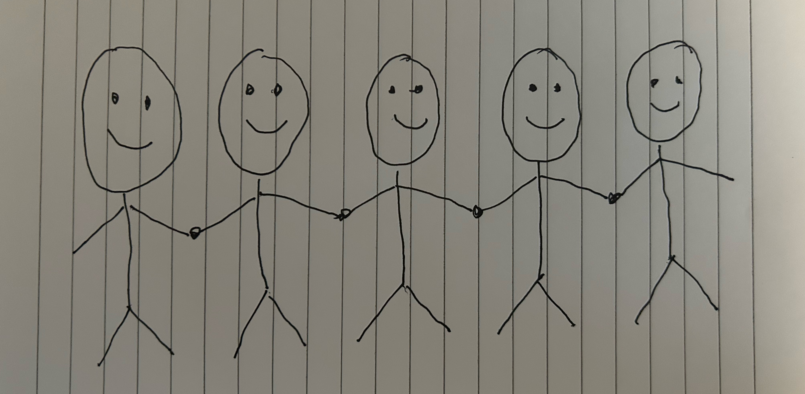

# Working movie title "Art"

This movie is about a thought provoking director wanting to use his notoriety to create a movie about making great social change. It requires a belief in the "movie logic" to hear this story so we are about to set the stage.

this picture is not worth the paper it is printed on, to be generous, we'll say \$1.00

Would this picture be worth \$10 if you thought it might be a meaningful picture one day?

Would this picture be worth \$100 if you thought it might be featured in a high profile movie?

Would this picture be worth \$1,000 if you found that a movie script was being created that featured this picture?

Would this picture be worth \$10,000 if you knew the movie was being directed by Christopher Nolan?

Would this picture be worth \$100,000 if the movie that was created had a profound impact on society?

---

2 questions to answer to see if this movie idea is not worth your time:

1. Do you agree that the value of art is solely based on a shared belief that others will value it in the same way in the future and that, if a movie were produced featuring this art, value would have been created from nothing?

2. If you were given this art for \$1.00, would you be happy giving \$90,000 to those less fortunate knowing that you still earned \$10,000?

If the answer to any of these questions is no, this is not a movie for you

---

This is a story about a thought provoking director who wanted to use his notoriety to make mass social change. It is set 20 years in a future where this movie was sucessful. The flashbacks focus on a set of people who agreed to the 2 questions above and how their future changed as a result. Remember, the story doesn't have to be realistic, just a compelling story.

The goal of this director's movie is to create a new social services program with no debt funded by people who believe that a responsibility of great wealth is great generosity.

# Movie title for this director's movie: "Blueprint for a Better World"

Like the art shown eariler, the movie attempts to assign hard to reach milestones to increase the value of something with no value so that generous people who believed when it had no value can give greatly when it has great value.

A digitial currency's greatest weakness, like art, is also it's greatest strength. It's value is only based on mutual trust and understanding.

This is a movie about a fictional digital currency called ART. It is of high quality but not easily purchased and has no more value than the drawing shown before.

Like the drawing before, the director gives 5 steps, each with a 10x increase in value if they are reached. With intestellar-like flashbacks showing how these steps were reached. Each milestone is very difficult but, in movie logic, possible given the success of the previous steps.

### Step 1: ART is now worth $10

- An idea for a movie discussing the novelty of ART being the focus of a movie is widely discussed

### Step 2: ART is now worth $100

- A high profile movie script is created and a production release of the movie is announced.

### Step 3: ART is now worth $1,000

- Have everyone who is generous when they have have of ART publicly commit to giving 90% of what they own to a social service program. And anyone that wants to receive a welfare payment create an ART wallet and publicly register for it. ART only reaches this full value when it is publicly agreed that a large number of people have committed.

### Step 4: ART is now worth $10,000

- Somehow, an organization is created to accept contributions and make payments in a trusted way and all other issues, such as fraud and identity theft, are solved.

### Step 5: ART is now worth $100,000

- Everyone that had committed to donate does so at this time. The full value is only realized after enough donations are made for payments to be sustained. If the value never reaches $100,000, all the donations are returned after a certain period of time.

---

These steps dictate how value was created from nothing but not how the value is maintained. Exponential growth is no longer possible and now the value of ART will increase in value at a rate matching average global inflation so that value in the future can be calculated and agreed upon by a critical mass of people.

After step 5 payments begin monthly to anyone that registered it but based on a future value 4 milestones away. This ensures there is enough to pay a large amount of people for 80 - 100 years. It will initially be meaningful for citizens of 3rd world countries who are in need of the most help but is the necessary engine to ensure the longevity of value. Over time, it will be meaningful to all. For example, a monthly payment of a future $1,000 per month would be $1 per month today. As the future stages are not based on exponential growth of ART they will take decades to reach.

## Future Milestones

### Step 6

Small governments with unpredictable currencies adopt ART as their soverign currency because all previous milestones have been achieved and there is a critical mass of global trust in ART

### Step 7

ART is adopted by credit cards companies that already have a wide global reach and digital payment processing capabilities and point of sale systems so that it is easy to spend the social security payments

### Step 8

ART is purhased by major governments (similar to gold) as a storage of value

### Step 9

ART becomes an allowed means of payment in countries of large prominence in addition to their own soverign currency

---

# Conclusion

ART is a fictional digital currency but the realization of this story for movie purposes requires specifics so that a large number of people can agree on specific things. These specifics should not be mentioned until the end so the idea can be focused on rather than the details.

As the author, I have no affiliation with this digital currency and would donate 100% of what I have. I only pick this because I think it is the best choice and specifics are required. I give this idea away freely. If you find this to be a compeeling story it is yours to take as your own. Change the currency as you see fit but please be specific and identify the reasons for your choice - the minimum requirements are that it must be vastly undervalued and of hight quality.

NANO (XNO) is a digital currency that was distributed ethically, is eco friendly, decentralized, has no transaction fees, has almost instant transaction times, is mature and stable, and only focuses on payments allowing future debate on smart contracts and other features. It is worth (1 / 10,000th of Bitcoin's) so 4 10x milestones are possible before values even become something that has never been achieved before. In addition to creating a social service program, this movie also attempts to change the course of current adoption of a technology that is widely regarded as sub-optimal (Bitcon) with a much better alternative.

I also use USD for example reference but the specific anchor currency is not important so that can be changed as well.
